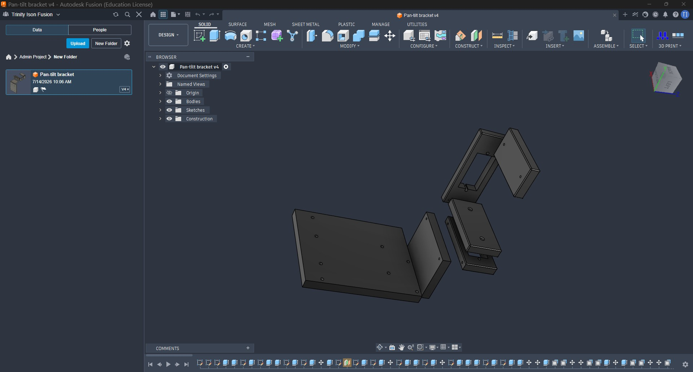
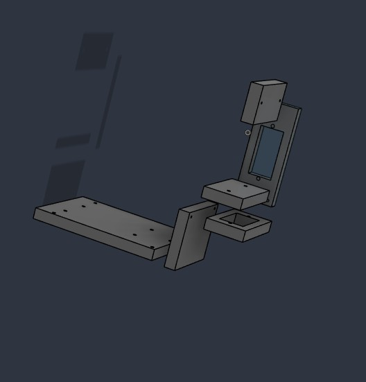
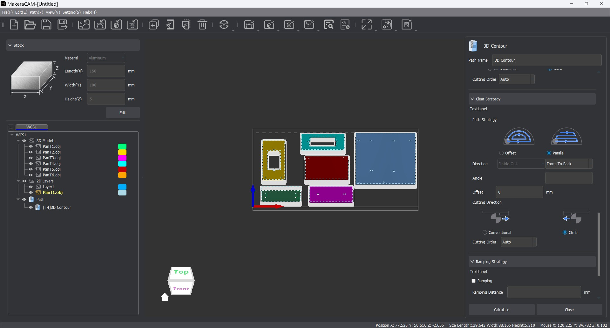
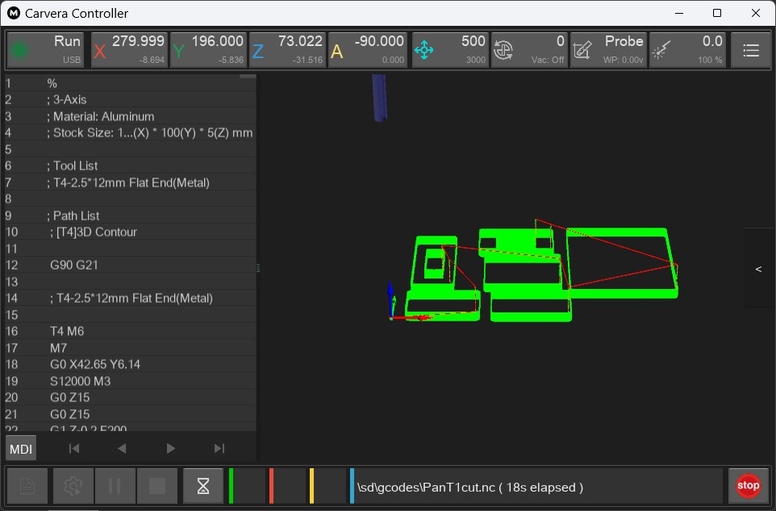

# Autonomous Pan-Tilt Tracking Camera

A two-axis camera platform designed in Autodesk Fusion 360, machined from aluminum on a Makera Carvera Air, and controlled by an Arduino Uno.

## Project scope

This repository documents the completed mechanical fabrication and servo bench-test stage. The mechanism provides independent pan and tilt motion and establishes the hardware foundation for a future autonomous vision-tracking phase. Autonomous tracking software is not included in the current stage.

## Demonstrated workflow

1. Designed the bracket components in Autodesk Fusion 360.
2. Exported six component models for manufacturing.
3. Arranged the parts and generated toolpaths in Makera CAM.
4. Used the Carvera Controller for machine setup, probing, and machining.
5. Assembled the camera and two-servo pan-tilt mechanism.
6. Uploaded the Arduino test sketch and verified safe pan and tilt movement.
7. Returned both axes to the 90-degree center position.

## Hardware

- Arduino Uno
- Two hobby servo motors
- Camera module
- Custom aluminum pan-tilt bracket
- External servo power supply
- Makera Carvera Air desktop CNC

## Software

- Autodesk Fusion 360
- Makera CAM
- Carvera Controller
- Arduino IDE
- Arduino Servo library

## Arduino connections

| Function | Arduino pin |
| --- | ---: |
| Pan servo signal | 10 |
| Tilt servo signal | 11 |
| Servo ground | GND |
| Servo power | External regulated supply |

The external supply and Arduino must share a common ground. Do not power high-current servos directly from the Arduino 5 V pin.

## Bench-test sequence

The sketch centers both axes, moves the pan axis to 120 and 60 degrees, returns pan to 90 degrees, moves tilt to 110 and 85 degrees, and returns tilt to 90 degrees. Both servos are detached after the one-time test.

The tested sketch is located at [firmware/panTiltTest/panTiltTest.ino](firmware/panTiltTest/panTiltTest.ino).

## Repository contents

- `cad/obj/` — six exported bracket components and material files
- `docs/` — five-page project documentation PDF
- `firmware/` — Arduino bench-test sketch
- `images/` — Fusion 360, Makera CAM, and Carvera Controller screenshots

## Manufacturing evidence

### Fusion 360 design

### Makera CAM toolpaths

### Carvera Controller machining job

## Current status

Mechanical design, CNC manufacturing, assembly, servo calibration, and bench testing are complete. Computer-vision detection and autonomous target tracking remain future work.

## References

Arduino. (n.d.-a). *Arduino UNO R3*. Arduino Documentation. https://docs.arduino.cc/hardware/uno-rev3/

Arduino. (n.d.-b). *Servo library*. Arduino Documentation. https://docs.arduino.cc/libraries/servo/

Arduino. (2022, September 2). *Basic servo control*. Arduino Documentation. https://docs.arduino.cc/tutorials/generic/basic-servo-control/

Arduino. (2024, March 4). *Servo motor basics with Arduino*. Arduino Documentation. https://docs.arduino.cc/learn/electronics/servo-motors/

Makera. (n.d.-a). *Makera CAM: Amazingly simple CNC CAM software*. Retrieved July 15, 2026, from https://www.makera.com/pages/makera-cam

Makera. (n.d.-b). *Software: Makera CAM and Carvera Controller*. Retrieved July 15, 2026, from https://www.makera.com/pages/software

Makera. (n.d.-c). *Makera CAM user guide*. *Makera Wiki*. Retrieved July 15, 2026, from https://wiki.makera.com/software/MakeraCAM_userguide

## Author

Trinity Matthew Ison  
Robotics and Embedded Systems
